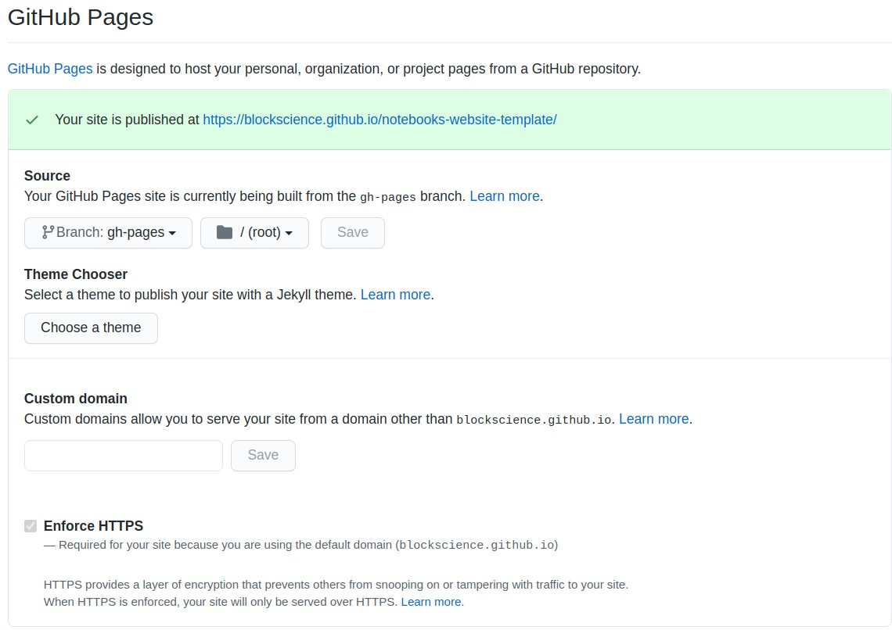

# Notebooks Website - Github Pages Branch

This branch is responsible for the creation of the website as a Github Page. Some observations:

- You can customize the `index.html` file as you like, but do not change the menu section, otherwise, the menu creation script will break because it is a little fragile.
- There are some options on the settings of the repository that may be of use for you, such as setting a custom domain. Just look for this section on the settings menu:

- Make sure the Pages website is being built from the root of the `gh-pages` branch as in the image.
- Your website will be published at `https://[your_user_name].github.io/[your_repo_name]`.
- You can erase this README.
